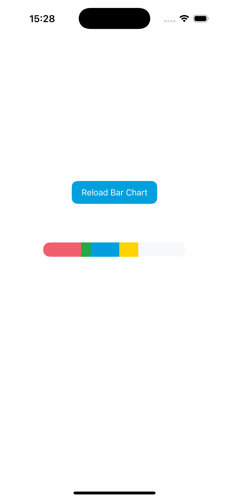

# 📊 BarChartView

A lightweight and customizable horizontal bar chart view for iOS built using UIKit. Ideal for visualizing usage data such as quota, storage, or resource distribution with animated colored segments.

---

## ✨ Features

- Smooth sequential animations for each usage segment  
- Customizable colors and segment widths  
- Lightweight UIKit-based implementation  
- Clean API with easy initialization  
- One-time animation on first layout pass

---

## 🧩 Example

```swift
let usageData = [
    BarChartView.UsageData(color: .systemRed, value: 2),
    BarChartView.UsageData(color: .systemBlue, value: 3),
    BarChartView.UsageData(color: .systemGreen, value: 1)
]

let chartView = BarChartView(
    usageData: usageData,
    totalValue: 8
)

chartView.frame = CGRect(x: 16, y: 100, width: 300, height: 20)
view.addSubview(chartView)
```

## 📐 API

BarChartView`
A UIView subclass for rendering a horizontal animated bar chart.

Initializer
```swift
init(frame: CGRect = .zero, usageData: [BarChartView.UsageData], totalValue: CGFloat)
```

Parameters
- `usageData`: An array of `UsageData` representing each segment's color and value.
- `totalValue`: The total value used to proportionally calculate segment widths.

## 🔄 Demo


